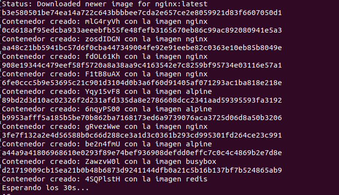
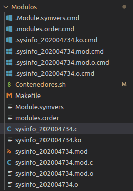
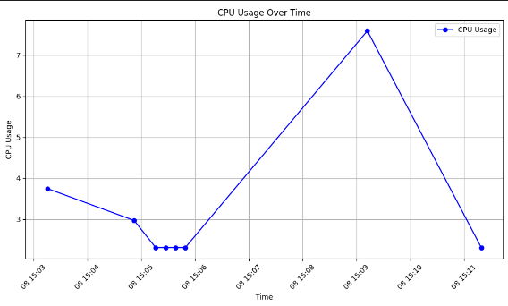

Universidad de San Carlos de Guatemala

Facultad de Ingeniería

Escuela de Ciencias y Sistemas

Laboratorio Sistemas Operativos 1

Segundo Semestre 2024

### Justin Josue Aguirre Roman - 202004734

# **GESTOR DE CONTENEDORES**

## **INTRIODUCCIÓN**
El presente documento tiene como funcion principal el presentar de manera ordenada y detallada todos los procesos, herramientas y utilidades (librerias, dependencias, extensiones, etc) que fueron necesarias en cada uno de los puntos de desarrollo del proyecto detallado generando de esta manera la mayor transparencia y mitigar cualquier punto de duda que pueda llegar a presentarse, de esta forma poder considerarlo como material educativo para efectos a futuro.

Se detalla el uso de script descriptivos para la creacion y eliminacion de contenedores de bajo y alto consumo dentro del equipo de trabajo, filtrado, organizacion de información y manejo de los procesos del sistema operativo. Implementandolo con servicios de virtualización con base en Docker y Python.

## **Script Creación de Contenedores**

Por medio de un script bash oara Sistemas Operativos con base Linux, se tiene la creacion de 10 contenedores cada 30 segundos, los cuales estan divididos de la siguiente manera:

* **Alto Consumo** 
    * **Consumo de CPU:**  Se usara nginx para su generacion.
    * **Consumo de RAM:** Se usara redis para su generacion.
* **Bajo Consumo:** Se opta por el uso de alpine y busbox para este modelo.

De esta manera por medio de RANDOM, para elegir entre alto y bajo consumo y sus derivdados; dev/urandom, para la generacion de manera aleatoria para los nombres de los contenedores. 

    ALTO_CONSUMO=("redis" "nginx")
    BAJO_CONSUMO=("alpine" "busybox")

    # Función para crear contenedores
    crear_contenedores() {
    # Generar un nombre aleatorio para el contenedor
        CONTAINER_NAME=$(head /dev/urandom | tr -dc A-Za-z0-9 | head -c 8)

        # Generar un número aleatorio entre 0 y 1
        RANDOM_NUM=$((RANDOM % 2))

        # Seleccionar aleatoriamente una imagen de alto consumo y bajo consumo
        if [ $RANDOM_NUM -eq 0 ]; then
        
            IMAGE=${ALTO_CONSUMO[$((RANDOM % ${#ALTO_CONSUMO[@]}))]}
        else
            
            IMAGE=${BAJO_CONSUMO[$((RANDOM % ${#BAJO_CONSUMO[@]}))]}
        fi

        # Crear el contenedor con la imagen seleccionada
        sudo docker run -d --name $CONTAINER_NAME $IMAGE sleep infinity
        echo "Contenedor creado: $CONTAINER_NAME con la imagen $IMAGE"
    }

Mientras para el reinicio del modulo y su vuelta a ejcución se realiza mediante un ciclo for de la siguiente manera:

    while true; do
        echo "Creando contenedores..."
        for i in {1..10};do
            crear_contenedores
        done
        echo "Esperando los 30s..."
        sleep 30
    done

Aqui un ejemplo de su funcionamiento:

## **Modulo de Kernel**

Por medio de código desarrollado en C, se hace la obtención de los datos de los procesos que hacen referencia al funcionamiento de los contenedores puestos en producción en el modulo anterior. Se hace la construcción en formato JSON con esta informacion, la cual sera escrita en un archivo con el nombre: **sysinfo_202004734**, dentro de la caroeta **/proc**. El formato JSON y los atributos a recopilar son los siguientes:

* PID
* Nombre
* Id del contenedor
* Vsz
* Rss
* Porcentaje de memoria en uso
* Porcentaje de CPU en uso

 Una vez teniendo el codigo finalizado, se hace uso de un archivo Makefile, el cual generara los archivos necesarios para acceder, obtener y escribir en archivos de la carpeta **/proc**. Esto mediante la instruccion make, dejandonos un folder parecido al siguiente:

**Nota:** Antes de continuar con el funcionamiento de los demas modulos, es importante mencionar que el archivo sysinfo_202004734.ko generado en el proceso **make** debera instalarse en el sistema operativo, con el fin de automatizar tareas se trabajo mediante el script bash incial con la siguiente instruccion, ejecutandose antes de ingresar al loop de su funcionamiento:

    sudo insmod sysinfo_202004734.ko    

## **Servicio en RUST**

Este sera el enargado del manejo, ordenamiento y eliminación de los contenedores cuando sea necesario según los siguientes parametros e instrucciones:

* Cada 10 segundos de ejecucion hara lectura del archivo **/proc/sysinfo_202004734** con toda la informacion en formato JSON y parseara a listas manejadas en rust.
* Hara el ánalisis de consumo por memoria, cpu, Vsz, Rss por el cual hara el ordamiento descendente, segun los parametros ya mencionados.
* Adicionalmente se tendra la funcionalidad de generar logs que serán enviados a un servicio en Python, este se encontrara virtualizado y sera el enargado y gestor de los Logs.
* Los contenedores luego de ordenados serán eliminados, dejando unicamente los 2 procesos con mayor consumo y los 3 con menos consumo (obviando el contenedor de Python admintrador de logs).

## **Administrador de Logs**

Este se encuentra dockerizado y se iniciara como primera instruccion del servicio en Rust. Para el correcto funcionamiento de este se tiene ajeno a la ejecucion en rust hasta que se envia la solicitud de recopilación de información y hara la generación de distintas graficas. Las cuales estan enfocasa al uso de memoria RAM general, uso de memoria RAM de los contenedores y el uso de CPU de los contenedores.

Para la dockerización del servidor de Python se tiene los siguientes archivos:

* Dockerfile
    
    FROM python:3.9-slim

    # 
    WORKDIR /code

    # 
    COPY  . /code

    # 
    RUN pip install --no-cache-dir --upgrade -r /code/requirements.txt

    # 
    EXPOSE 8080

    CMD ["fastapi", "run", "main.py", "--port", "8080"]

* docker-compose
    
    services:
        python_service:
        image: python_server
        container_name: python_server
        ports:
            - "8080:8080"
        volumes:
            - ./logs:/code/logs

Una vez finalizado el proceso completo de Rust y nuestro bash, podemos hacer la solicitud de generación de graficos. Se tiene el siguiente modelo para ello:

## **REFERENCIAS**
* [LINK REPOSITORIO - GITHUB](https://github.com/JtAgu/SO1_2S2024_202004734/tree/main/Proyecto1)
